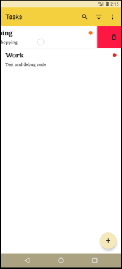

### 1. **Project Title & Description**
This is a simple **TODO application** built using **_Jetpack Compose_**. 
The app allows users to create, edit, and delete tasks, with the ability to search or filter tasks. It leverages modern Android development tools and practices, ensuring a smooth and responsive user experience.

### 2. **Features**
- Add new tasks with descriptions.
- Edit existing tasks.
- Search or Filter task.
- Delete tasks and swipe to delete task.
- Persistent storage using Room database.
- Responsive UI built with Jetpack Compose.

### 3. **Libraries and Tools**
- **Jetpack Compose**: For building the UI.
- **Room**: For local database storage.
- **Kotlin**: The programming language used.
- **Hilt**: For dependency injection.
- **Coroutine**: For asynchronous programming.
- **Navigation Component**: For managing in-app navigation

### 3. **Screenshots**

